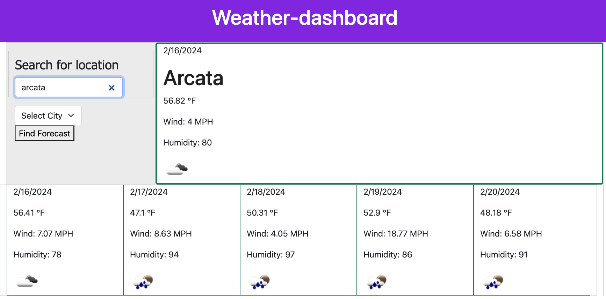

# Table of Contents
Open Weather Search Tool
- [Description](#description)
- [Installation](#installation)
- [Usage](#usage)
- [Contributing](#contributing)
- [License](#license)
- [Questions](#questions)
- [Screenshots](#screenshots)

## Project Name
Open Weather Search Tool

## Description
This is a simple weather application using the OpenWeather API. 

## Usage
Enter a city name in the search bar to view current and predicted weather in that city. 

## Contributing
Download repository from Github [https://github.com/crunchwrapdestroyer/Open-Weather-Search-Tool](https://github.com/crunchwrapdestroyer/Open-Weather-Search-Tool)
Fork the repository and contact Matt Hill with any questions.

## License

## Questions
- Email: [hillmatt58@gmail.com]()
- GitHub: [crunchwrapdestroyer](https://github.com/crunchwrapdestroyer)
- [recording of working application]()

## Screenshots
